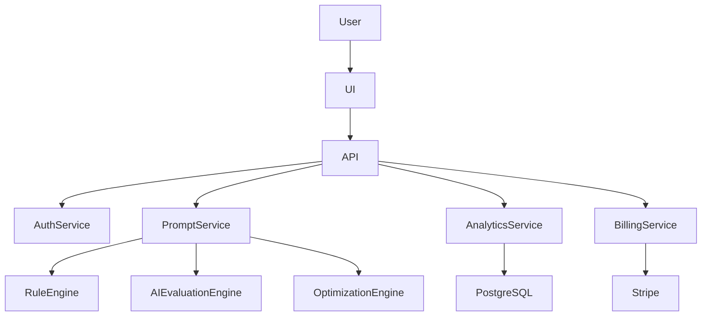

# PromptMaster AI

## System Architecture

### Architecture Principles

- Cloud native
- API first
- AI native
- Multi tenant

### High-Level System Context

### Core Components

- Frontend application
- API gateway / backend services
- Prompt analysis engine
- Optimization engine
- Analytics service
- Billing service
- Authentication provider
- PostgreSQL primary datastore
- Redis cache

### Security Architecture

- Tenant isolation
- Role-based access control
- Row-level access control where applicable
- TLS in transit
- Encryption at rest
- Secret management for API keys

### Scalability Approach

- Stateless API services
- Cache hot reads in Redis
- Separate compute for analysis and optimization
- Horizontal scaling for API workloads
- Async processing for expensive AI calls

### Disaster Recovery

- Automated database backups
- Versioned infrastructure configuration
- Environment-separated deployment pipeline
- Restore procedures for critical data

